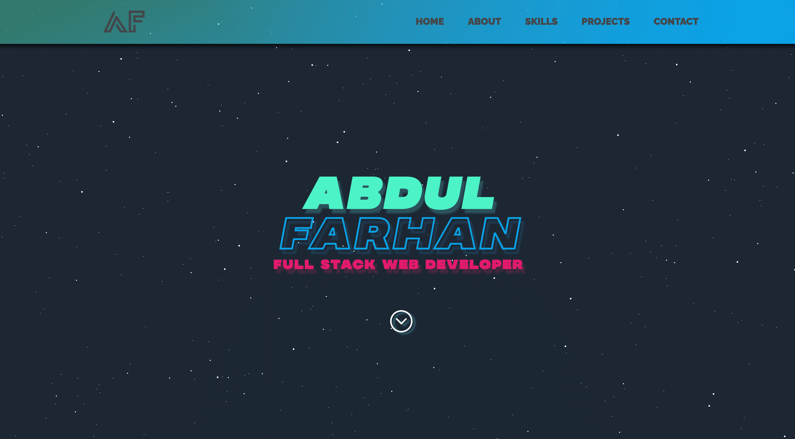

# Portfolio

## Full-Stack Web Developer

Welcome to my portfolio!

- Here:
  - You will learn a little bit about me.
  - My current skills as a full stack developer.
  - Projects I have worked on.

### Project Stats

  


### Demo

Deployed live on <https://abdulfarhan.com/>



### Main Tech Stack Used

  

### Other Tech Used To Compliment The Project

1.  Animate on Scroll (AOS)
1.  React Scroll
1.  Framer Motion
1.  Email JS
1.  UUID

### Continuous Integration (CI)


### How To Run The App

1. Either `fork` or download the app and open the folder in CLI
1. Install all dependencies using the `npm i` command.
1. Start the web server using `npm start` command. The app will be served at <http://localhost:3000>
1. Go to <http://localhost:3000> in your local browser to view the app.

### App Dependencies And Version Numbers

```json
"dependencies": {
    "@testing-library/jest-dom": "^5.11.5",
    "@testing-library/react": "^11.1.1",
    "@testing-library/user-event": "^12.2.0",
    "aos": "^2.3.4",
    "emailjs-com": "^2.6.4",
    "framer-motion": "^2.9.4",
    "react": "^17.0.2",
    "react-dom": "^17.0.2",
    "react-router": "^5.2.0",
    "react-router-dom": "^5.2.0",
    "react-scripts": "4.0.0",
    "react-scroll": "^1.8.1",
    "sass": "^1.38.2",
    "uuid": "^8.3.1",
    "web-vitals": "^0.2.4"
  }
```

### Future Iterations

1. Blog page that will contain articles about my journey in tech and things I have learnt as a web developer.
1. Shift over my portfolio from React.js to Next.js framework.
1. Internationalization support (i18n) for both English and French.
